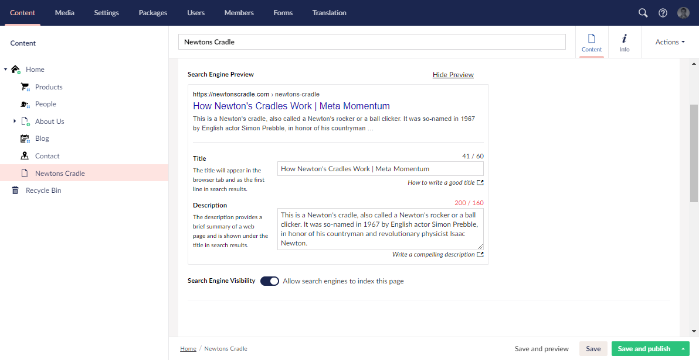
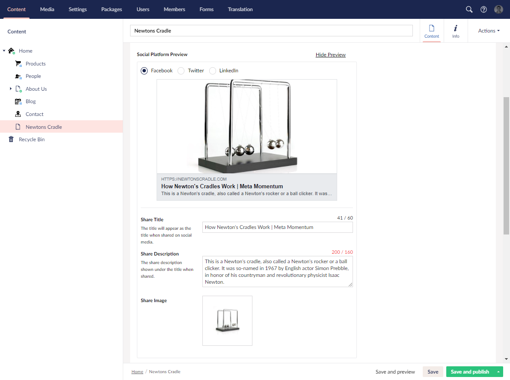

# Meta Momentum for Umbraco 8, 9 and 10

#### A DataType to manage Search engine results (Title, Description & No Follow) /  open Graph / Twitter cards

Meta Momentum is an Umbraco Data Type editor to manage SEO Title & description tags and Open Graph / Twitter Cards, 
with a visual representation of how it will look in a Google Search / Social Platform. 


## Search features
The search display follows googles search restrictions in terms of titles being restricted by width, instead of a character count. 
This gives the user a good idea on how the title / description will show in an actual google search.

Additionally, you can specify fallbacks to other text properties in the document, so that the title for instance will fall back to a "Page Title" property 
if no title tag is supplied by the user.

## Share Features
The Socal Share preview will give an acurate preview of the Facebook, Twiter and Linked in share previews. 
The content editor can swtich between the 3 previews to see how they will look when shared.

You can specify falbacks to other text fields for the share title and description. 


## Backwards Compatible with Seo Metadata...

This plugin was inspired by [Seo Meta by Ryan Lewis](https://github.com/ryanlewis/seo-metadata) which I've used for Umbraco 7 for many years and 
was no longer being maintained and not avaliable for Umbraco 8, 9 and 10.

If you were using this plugin in Umbraco 7, you can replace your SeoMetadata document type with Meta Momentum without any migration of data, or mucking around.


## Editor Screenshot




## Installation
You can either install the plugin is though Nuget or using the package manager in Umbraco.

After installation, you can create and configure a new MetaMomentum Data Type **Umbraco -> Settings -> Data Types -> New Data Type**. 

Install stable releases via Nuget; development releases are available via MyGet.

| Package Name                   | Release (NuGet) | Nightly (MyGet) |
|--------------------------------|-----------------|-----------------|
| `MetaMomentum`         | [](https://www.nuget.org/packages/MetaMomentum/) | [](https://www.myget.org/feed/digital-momentum/package/nuget/MetaMomentum) |
| `MetaMomentum.Core`         | [](https://www.nuget.org/packages/MetaMomentum.Core/) | [](https://www.myget.org/feed/digital-momentum/package/nuget/MetaMomentum.Core) |

## Configuration
Canfiguration can be done via the following Data Type setting fields: 

- *Title / Description fields for search:* Turn this on to allow the content editor to edit the title and description tags. 
If turned off the content editor will not be able to edit the title and description and will be shown the text from the default falbacks.

- *Google Search Preview:* Turn on to show the google search preview to the content editor. This will show a preview of how the Google search entry will look

- *Fallback Title Fields:* You can enter a comma seperated list of DataType aliases, so that if the title is not filled in by the user, it will fall back to each alias in the list. 
If the alias is not filled in or does not exist in the DocType, then it will fall back to the next, until finally, it will use the page name as the title. 
The fallbacks only support fields in the form of a string, and does not support complex data types like the grid or nested content.

- *Fallback Description Fields:* This is the same as the Fallback Title fields setting, however, if it finds no value, the description will be empty. 

- *Fallback Image Fields:* Same as Fallback Title Fields, but for images. You can specify media picker or upload fields (*Upload feild is limited*) as fallbacks. *Note: Upload fields have Limitations: When the image falls back to an upload field, the first time an image is selected, it needs to be saved and published twice (once to upload the image, and then a second time for it to be saved into the social media image).*

- *Social Share fields:* Turn this on to allow the content editor to edit the title and description tags for the share meta. 
If turned off the content editor will not be able to edit the title and description and will be shown the text from the default falbacks.

- *Facebook, Twitter, LinkedIn share preview*: These 3 options will allow you to turn on / off the different share prewviews avaliable to the content editor. 

### App Settings
Additional global configuration can be added via the web.config AppSettings (Umbraco V8) Or AppSettings.json (Umbraco V9)

##### Umbraco V8 (via Web.config)

Add the following to the web.config Config -> Appsettings:

 - `<add key="MetaMomentum.OGSiteName" value="Meta Momentum" />` This sets the MetaMomentum.OGSiteName property which can be used to set the the `og:site_name` meta tag.

 - `<add key="MetaMomentum.TwitterName" value="@DigitalMomentum" />` This sets the MetaMomentum.TwitterName property which can be used for the `twitter:site` meta tag for the Twitter Cart

 - `<add key="MetaMomentum.FacebookId" value="12345" />` This sets the MetaMomentum.FacebookId property which can be used for the `fb:app_id` meta tag for the Facebook App ID, when sharing to facebook

 ##### Umbraco V9/V10 (via Appsettings.json)
 Add the following to the app settings.json file
 ```
"MetaMomentum": {
    "OGSiteName": "Meta Momentum",
    "TwitterName": "@DigitalMomentum",
    "FacebookId": "12345" 		
}
 ```

##### Umbraco V9/V10 (via Startup.cs)
You can add dynamic settings in the `startup.cs` file by adding `.AddMetaMomentum()` before `.Build()` so it looks like the following:
```
services.AddUmbraco(_env, _config)
    .AddBackOffice()
    .AddWebsite()
    .AddComposers()
    .AddMetaMomentum(
    c => {
        c.TwitterName = "@DM";
        c.OGSiteName = "MetaMomentum";
    }
)
.Build();
```

## Usage
There is a razor file that can be found under `/Views/Partials/Metamomentum/RenderMetaTags.cshtml` which will write out the specific tags. 
This can be included in the head of each page like the following (where `metaMomentum` is the DataType alias):

```c#
 @Html.Partial("MetaMomentum/RenderMetaTags", Model.Value("metaMomentum"))
```

Or in Umbraco 9/10:

```html
 <partial name="MetaMomentum/RenderMetaTags" model="Model.MetaMomentum" />
```

Alternatively, you can access each of the properties using the following syntax:

```c#
Title:				@Model.Value<MetaMomentum.Models.MetaValues>.Title
Description:			@Model.Value<MetaMomentum.Models.MetaValues>.Description
Share Title:			@Model.Value<MetaMomentum.Models.MetaValues>.ShareTitle
Share Description:		@Model.Value<MetaMomentum.Models.MetaValues>.ShareDescription
Share Image:			@Model.Value<MetaMomentum.Models.MetaValues>.ShareImageUrl
Open Graph Site Name:		@Model.Value<MetaMomentum.Models.MetaValues>.OGSiteName
TwitterName:			@Model.Value<MetaMomentum.Models.MetaValues>.TwitterName
FacebookAppId:			@Model.Value<MetaMomentum.Models.MetaValues>.FacebookAppId
```

Or with Models Builder, strongly typed models:

```c#
Title:				@Model.MetaMomentum.Title
Description:			@Model.MetaMomentum.Description
Share Title:			@Model.MetaMomentum.ShareTitle
Share Description:		@Model.MetaMomentum.ShareDescription
Share Image:			@Model.MetaMomentum.ShareImageUrl
Open Graph Site Name:		@Model.MetaMomentum.OGSiteName
TwitterName:			@Model.MetaMomentum.TwitterName
FacebookAppId:			@Model.MetaMomentum.FacebookAppId
```


## Version History

##### V1.0:
 - Initial release.

##### V1.1:
 - Added support for fallback images.
 - Added **og:title** tag (defaulting to website) to the RenderMetaTags.cshtml partial.

##### V1.2:
 - Added mediapicker3 support for Umbraco 8.14+

##### V2.0:
 - Full Umbraco 9.0+ Support
 - Bug fix: Fallbacks to the Image Cropper field threw an error

##### V2.1:
- Split Compiled DLL into separate MetaMomentum.Core project

##### V2.1.1:
- Bugfix: Umbraco displays "Discard Changes?" when changing bewteen social previews
- Featue: Allow hiding the "No Index" toggle via settings

##### V2.2:
- Update UI to use the new Umbraco UI Library
- RTE / Html fallbacks now strip the HTML tags
- Bug Fixes and performance inprovements


## Pre-Release Versions

If you can't wait for a feature to be released, you can install the latest pre-release version via my MyGet feed. 
These versions are quickly tested, but may at time cause 


## Contributing

To report a new bug, create an issue on the github repository. 

To fix a problem or add features:

1. Fork the Project
2. Create your Feature Branch (`git checkout -b feature/AmazingFeature`)
3. Commit your Changes (`git commit -m 'Add some AmazingFeature'`)
4. Push to the Branch (`git push origin feature/AmazingFeature`)
5. Open a Pull Request

I reccomend creating an issue on the issue tracker before adding to discuss new features to make sure that we can include them. Any contributions you make are greatly appreciated. 


### Running the project

A working umbraco installation is setup under MetaMomentumPageMeta.Umbraco which contains the App_plugins folder and the partial view. 

You can login to the back office with

email: admin@example.com
password: password99
